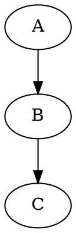
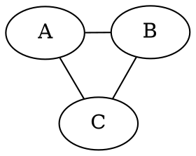

# Graphviz Plus

An Obsidian plugin that renders graphviz diagrams written in DOT, the graphviz
graph description language.

Note: written with the assistance of Claude Code.

The plugin runs graphviz as WebAssembly, compiled inside Obsidian. There's no
need to install graphviz on your machine, and the plugin (should) work on both
desktop and mobile.

Two features beyond rendering:

- **a shared preamble**: there is a setting in which you can set your default
  styles; the plugin prepends it before every diagram
- **CSS control**: the plugin puts the SVG in the page rather than inside an
  `` element, so a CSS snippet can select nodes and edges and set colors
  for all diagrams at once

## Installation

**BRAT** is a community obsidian plugin that installs a plugin from a github
release and keeps it up to date. It can be used to get the same version on every
machine.

1. install the community plugin **Obsidian42 - BRAT**
2. in BRAT, select **Add beta plugin**
3. enter this repository's github URL, then click **Add**
4. open **Settings > Community plugins** and turn on **Graphviz Plus**

### Development notes

BRAT reads the assets of the latest github release, so the repository needs at
least one release that carries `main.js`, `manifest.json`, and `styles.css`. The
workflow in `.github/workflows/release.yml` builds and attaches those three
files when you push a tag.

To install without BRAT, copy those same three files into
`<vault>/.obsidian/plugins/graphviz-plus/`.

## Example

Write a fenced code block and mark it `dot`:

````markdown

````

In obsidian: the block renders in Reading view; in Live Preview, it renders once
you move the cursor out of the block.

Apart from inserting the preamble described below, the plugin passes the block
to graphviz as you wrote it. So every DOT feature should work: node shapes,
`subgraph cluster_...` containers, `arrowhead=...`, HTML-like labels, etc.

The plugin uses the `dot` code fence; hopefully this does not break other
plugins (but if it does, please feel free to open a PR).

## Layout engines

A layout engine is the algorithm that decides where nodes and edges go.
Graphviz ships several, and they suit different graph shapes:

| engine      | layout                                | use for                             |
| ----------- | ------------------------------------- | ----------------------------------- |
| `dot`       | hierarchical, nodes assigned to ranks | cascades and other DAGs             |
| `neato`     | spring model, by stress majorization  | small interaction networks          |
| `fdp`       | spring model, by force reduction      | medium interaction networks         |
| `sfdp`      | `fdp` with a multilevel solver        | large interaction networks          |
| `circo`     | circular                              | networks built from cycles          |
| `twopi`     | radial, around one root node          | trees with a single centre          |
| `osage`     | clusters packed into an array         | graphs that are mostly clusters     |
| `patchwork` | squarified treemap                    | trees where node area shows a value |

Set the engine for one block with the `layout` attribute, quoted or unquoted:



Blocks that set no `layout` attribute use the engine from **Settings -> Graphviz
Plus -> Default layout engine**.

## Shared preamble

DOT has no include directive, so shared styles would otherwise be copied into
every block. Instead, put them in one note and name that note in the settings.

1. Create a note, for example `graphviz-preamble`.
2. Open **Settings -> Graphviz Plus**.
3. Enter the note's name or vault path in **Preamble note**.

The note holds either raw DOT or a fenced block marked `dot` or `graphviz`, or
marked with nothing. When it holds several fenced blocks, the plugin uses the
first block that carries one of those marks and ignores the rest. Example
contents:

```
rankdir=LR; bgcolor="transparent";
node [shape=box, style="rounded,filled", fontname="DejaVu Sans"];
edge [fontname="DejaVu Sans", arrowsize=0.8];
```

The plugin inserts this text directly after the `{` that opens the graph body,
where graph, node and edge attribute statements are legal. So the note holds
statements, not a whole graph: no `digraph { … }` wrapper.

A block can still override anything the preamble sets, because the block's own
statements come after it.

Leave **Preamble note** empty to insert nothing. The settings tab reports
whether the path you entered refers to a note. If it doesn't refer to anything,
the plugin renders diagrams without a preamble.

## CSS styling

Obsidian supports stylesheets, so that a style can be applied to the entire
vault. Because the plugin puts the SVG in the page, a snippet can reach the
graph and set its colors.

1. copy `graphs/graphviz.css` into `<vault>/.obsidian/snippets/`
2. turn it on under **Settings -> Appearance -> CSS snippets**

The snippet selects `.block-language-dot g.node`, `g.edge` and the entity
classes below. It overrides colors written in the DOT source, because SVG
presentation attributes such as `fill=` have lower priority than any CSS rule.

Give a node a class in DOT to pick its color:

```dot
IKK [class="complex", shape=record, label="{IKKα|IKKβ|NEMO}"]
```

The snippet defines the classes `complex`, `chemical`, `gene` and `process`. A
node with no class is drawn as a macromolecule. Its palette sits in one block of
CSS variables at the top of the file, so you change a color in one place.

Keep each color in one place: either in the DOT source, which renders the same
everywhere, or in the snippet, which applies across the vault. Setting a color
in both makes the DOT value unused.

## Settings

- **preamble note**: the note whose DOT the plugin inserts into every block;
  empty means no preamble
- **default layout engine**: the engine used by a block that sets no `layout`
  attribute; one of `dot`, `neato`, `fdp`, `sfdp`, `circo`, `twopi`, `osage` or
  `patchwork`; default is `dot`

## Errors

The plugin prints a DOT error inside the block and leaves the rest of the note
alone. For example, the erroneously structured block `digraph { A -> }` prints:

```
Graphviz error:
syntax error in line 1 near '}'
```

Graphviz reports syntactic errors only; it silently accepts any attributes or
any attribute values.

## Styles for pathway diagrams

`graphs/diagram-conventions.md` describes the conventions these sample diagrams
follow: which node shape stands for which entity, which arrowhead stands for
which relation, and how to draw compartments. It follows SBGN, the Systems
Biology Graphical Notation, closely enough to stay readable to people who know
that notation. The `graphs/` folder holds worked examples.

## Development

```bash
npm install
npm run dev   # esbuild rebuilds main.js on every save

# Load the plugin from a test vault, to avoid conflicts with the installation
# vault:
ln -s "$PWD" "<test-vault>/.obsidian/plugins/graphviz-plus"
```

Then turn the plugin on, under **Settings -> Community plugins**. The community
plugin **Hot-Reload** (`pjeby/hot-reload`) reloads it after each rebuild, which
saves you the "Reload app without saving" command.

`npm run build` type-checks the source and writes the `main.js` that ships in a
release.

## License

MIT. See `LICENSE`.
